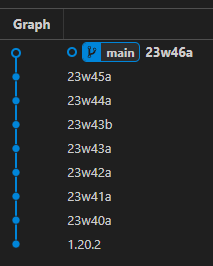

# McDiff

A tool to keep track of newer Minecraft versions.

⚠️ WARNING ⚠️: You CANNOT publish any code generated by this tool.

## TODO
- [x] Generate a private git repo with the changes.
- [ ] Config file support
- [ ] Custom jar mapper (a.k.a. remove enigma)
- [ ] Mandatory rewrite in rust

# Dependencies
- Enigma: https://github.com/FabricMC/Enigma
- VineFlower: https://github.com/Vineflower/vineflower